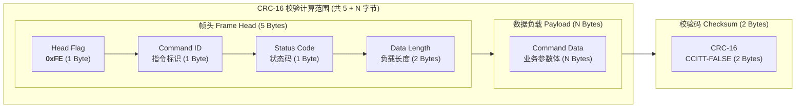
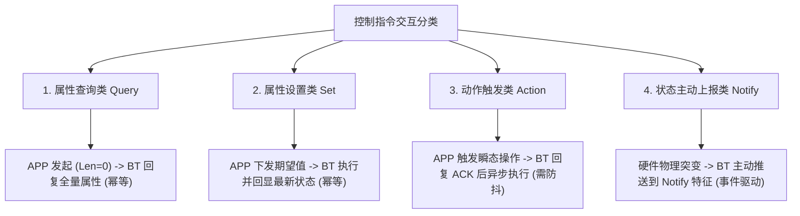
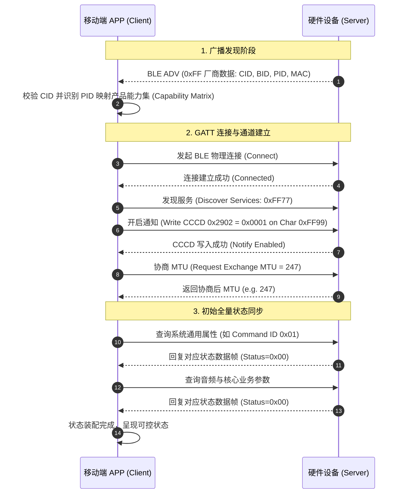
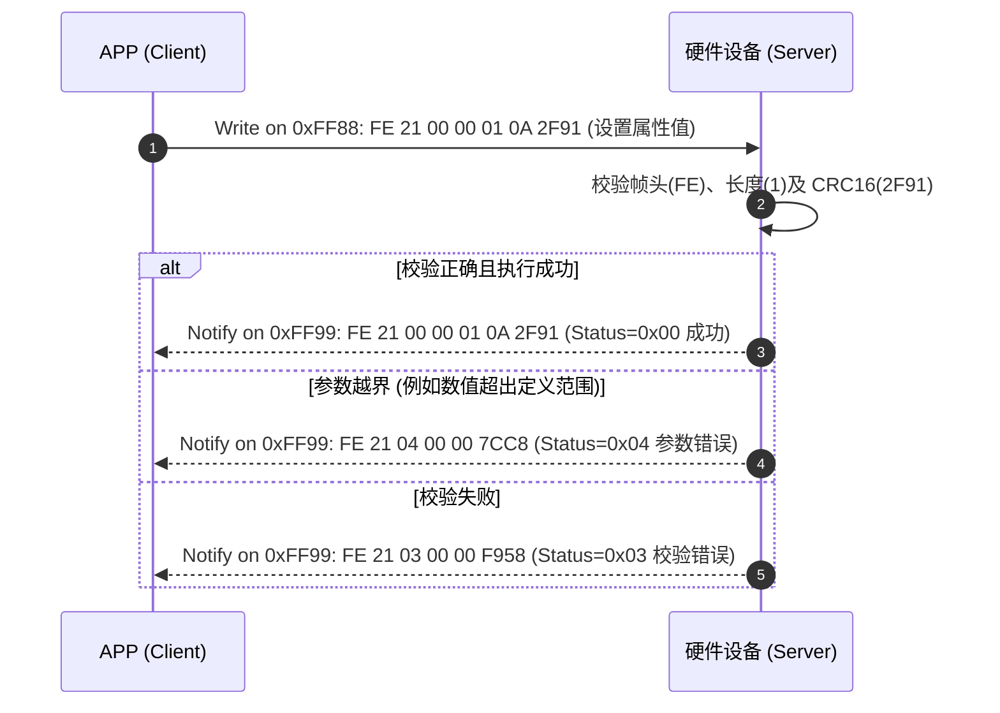
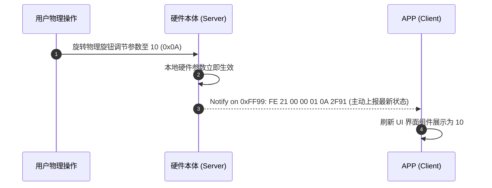

BLE API 规范关注的是移动端 APP 与蓝牙硬件设备之间在低功耗蓝牙（BLE GATT）层面的通信协议设计、广播过滤识别、数据帧封装、通用指令交互体系与状态同步机制。

BLE（Bluetooth Low Energy）采用客户端/服务端（Client/Server，即 Central/Peripheral）通信架构。APP 作为 GATT Client，硬件设备作为 GATT Server；通过自定义 Service 与 Characteristic 实现双向数据交换，并通过 Manufacturer Specific Data 广播实现设备敏捷发现与型号判定。

# 一、前提

为了统一移动端（iOS / Android）与嵌入式固件端的交互，提高通信可靠性、可读性、可维护性与可扩展性，所有 BLE 交互必须遵循以下基础约定：

- **传输层基础**：基于标准 BLE GATT 协议栈，依托专用 Service 与 Characteristic 进行读写与监听。
- **大端字节序**：所有多字节整型数值（包括数据长度 `Length`、校验码 `CRC16`、产品标识 `PID` 等）均严格采用大端序（Big-Endian，网络字节序，高位在前，低位在后）。
- **统一帧结构**：所有通过 GATT Characteristic 发送与接收的数据包均使用统一的“帧头 + 指令 ID + 状态码 + 长度 + 负载 + CRC16”封装。
- **可靠校验**：传输帧统一采用 CRC-16/CCITT-FALSE 校验算法，杜绝无线传输过程中的误码。
- **双向通信模型**：支持“APP 下发请求/设置并接收 ACK/响应”以及“设备状态突变主动 Notify 上报”两种模式。

## 1.1 字符集与字符串编码

- 所有文本字符串（如设备蓝牙名称 `device_name`）均统一使用 **UTF-8** 编码。
- 文本长度受通信包及固件存储限制，最大长度不得超过 32 字节（即 `N <= 32`），末尾无需包含 C 语言字符串结束符 `\0`。

## 1.2 字节序与数据类型

| 类型定义 | 字节长度 | 说明 | 示例 |
| --- | --- | --- | --- |
| `UInt8` | 1 Byte | 无符号 8 位单字节整数 | `0x01`（值为 1） |
| `Int8` | 1 Byte | 有符号 8 位整数（补码表示，-128 ~ 127） | `0xFE`（-2 dB） |
| `UInt16` | 2 Bytes | 无符号 16 位大端整数（高位在前） | `0x000A`（值为 10） |
| `UInt8[]` | N Bytes | 字节数组或特定二进制结构体 | 见各指令定义 |
| `String` | N Bytes | UTF-8 编码字节流（最大 32 字节） | `"SmartAudio"` |

## 1.3 核心设计原则

1. **确定性与闭环响应**：除单向触发类动作外，APP 向设备发送的每条指令，设备均必须回复携带状态码（Status Code）的响应帧；禁止单向吞没响应。
2. **状态驱动与主动上报**：当设备发生物理操作（如按键调节音量、插拔接口、电量变化等）时，设备端必须通过 Notify 特征主动将最新状态同步给 APP，保证两端状态强一致。
3. **幂等性控制**：对于查询类与赋值设置类指令（如查询电量、参数配置）必须设计为幂等操作；对于触发类指令（如切歌、恢复出厂、关机）须在 APP 端做防连击节流保护（防抖 ≥ 500ms）。

---

# 二、BLE 广播与设备发现

设备在未被连接或处于可发现状态时，会周期性发送 BLE 广播包。APP 扫描阶段无需发起 GATT 连接即可通过厂商自定义广播数据（Manufacturer Specific Data，AD Type `0xFF`）完成设备过滤、型号判定与经典蓝牙 MAC 获取。

## 2.1 厂商自定义数据结构

广播数据段中 AD Type 为 `0xFF` 的厂商自定义数据（Manufacturer Specific Data）布局如下：

| 字节偏移 (Offset) | 字段名 | 长度 (Bytes) | 取值 (Hex) | 说明 |
| --- | --- | --- | --- | --- |
| Byte 0 | `Length` | 1 | `0x1E` 等 | 后面数据的总字节数（不包含 Length 本身） |
| Byte 1 | `Type` | 1 | `0xFF` | 厂商自定义数据标志（EIR / AD Type: Manufacturer Specific） |
| Byte 2~3 | `CID` | 2 | `0x22FC` 等 | 厂商识别码（Company Identifier，由 Bluetooth SIG 统一分配或企业定义，用于广播过滤识别所属硬件体系） |
| Byte 4~5 | `BID` | 2 | `0x0001` 等 | 品类/品牌识别码（Brand ID / Category ID，用于区分产品系列或产品形态） |
| Byte 6~7 | `PID` | 2 | `0x0001` ~ `0xFFFF` | 产品型号识别码（Product ID，大端序，详见 2.3 节） |
| Byte 8 | `STATE` | 1 | `0x00` / `0x01` | 经典蓝牙（BR/EDR）连接状态：`0x00` 未连接，`0x01` 已连接 |
| Byte 9~14 | `MAC` | 6 | 6 Bytes | 经典蓝牙 MAC 地址混淆数据（按字节与 `0xAD` 异或加密） |
| Byte 15~30 | `RESERVE` | 16 | 全 `0x00` | 保留位，用于后续扩展，固件固定用 `0x00` 补位填充 |

## 2.2 经典蓝牙 MAC 地址混淆与还原算法

为了防止被公开嗅探并关联设备，广播中的 6 字节经典蓝牙 MAC 地址采用固定异或掩码（XOR Mask `0xAD`）存储。

### 混淆与还原公式：

$$\text{Original\_MAC}[i] = \text{Raw\_MAC}[i] \oplus 0\text{xAD} \quad (0 \le i \le 5)$$

```typescript
/**
 * 经典蓝牙 MAC 地址解析还原示例 (TypeScript)
 * @param obfuscatedBytes 从广播中提取的 6 字节 MAC 字段
 * @returns 标准格式 MAC 地址，如 "AA:BB:CC:DD:EE:FF"
 */
function decodeClassicMac(obfuscatedBytes: Uint8Array): string {
  const macHex: string[] = [];
  for (let i = 0; i < 6; i++) {
    const originalByte = obfuscatedBytes[i] ^ 0xAD;
    macHex.push(originalByte.toString(16).padStart(2, '0').toUpperCase());
  }
  return macHex.join(':');
}
```

## 2.3 产品型号识别码 (PID) 与能力集 (Capability) 映射机制

APP 端根据广播中的 `PID`（大端 2 字节）映射对应的产品型号与设备能力集（Capability Matrix），以实现 UI 渲染与功能支持的动态装配，避免针对特定型号硬编码逻辑。


### 2.3.2 设备能力集解耦模型

APP 建立连接后，依据 PID 获取预置或云端动态下发的设备能力元数据，按需启用对应的指令集与控制面板：

| 产品分类示例 | 示例 PID | 硬件形态 | 支持的核心能力矩阵 (Capability Matrix) |
| --- | --- | --- | --- |
| 便携蓝牙音箱 (基础款) | `0x0001` | 单体音箱 | 基础播放控制、单电量显示、预设 EQ 切换 |
| 桌面立体声音箱 (高阶款) | `0x0101` | 双声道音箱 | 10 段自定义 EQ、TWS 对联、RGB 氛围灯效、多音源切换 (AUX/TF/BT) |
| TWS 降噪耳机 | `0x0201` | 双耳+充电仓 | 三电量独立显示 (L/R/Case)、ANC/通透模式切换、手势按键自定义 |
| 多功能户外音箱 | `0x0301` | 扩音音响 | 麦克风高低音/回声混响调节、人声变声音效、气氛音效触发、外置存储读取 |

---

# 三、GATT 通信架构与服务定义

设备与 APP 通过标准的 BLE GATT 协议通信。在建立物理连接后，APP 需发现自定义服务并开启相关特征的监听。

## 3.1 服务与特征分配 (UUID)

| 类型 (Type) | 属性 (Properties) | 128-bit 标准 UUID | 16-bit 别名 | 说明 |
| --- | --- | --- | --- | --- |
| **Control Service** | - | `0000FF77-0000-1000-8000-00805F9B34FB` | `0xFF77` | 核心控制服务 |
| **Write Characteristic** | `Write` / `Write Without Response` | `0000FF88-0000-1000-8000-00805F9B34FB` | `0xFF88` | APP 向设备下发控制指令与查询请求 |
| **Notify Characteristic** | `Notify` | `0000FF99-0000-1000-8000-00805F9B34FB` | `0xFF99` | 设备向 APP 发送指令回复及主动状态上报 |

> [!IMPORTANT]
> APP 建立连接后，必须第一时间向 `0xFF99` 特征的 CCCD（Client Characteristic Configuration Descriptor，UUID: `0x2902`）写入 `0x0001` 以启用 Notification 监听；否则将无法收到任何设备响应与上报数据。

## 3.2 链路交互参数与 MTU 协商

1. **MTU 交换 (Exchange MTU)**：
   - BLE 默认 ATT_MTU 为 23 字节（有效负载 20 字节）。
   - 连接建立并开启通知后，APP 端建议立即请求 MTU 协商，推荐协商至 **247 字节**（或 512 字节），保证长指令可在单个 ATT PDU 内完整发送，避免固件端进行分包重组。
2. **连接间隔 (Connection Interval)**：
   - 推荐配置：7.5ms ~ 20ms，平衡响应延迟与功耗。

---

# 四、通用数据帧协议规范

无论是 APP 发给设备的指令，还是设备发给 APP 的回复与上报，所有通信数据均封装在统一格式的数据帧中。

## 4.1 帧结构定义

数据帧由 **帧头（Frame Head）**、**指令数据（Command Data Body）** 和 **校验码（Checksum）** 三部分组成：


```mermaid
flowchart LR
    subgraph CRC["CRC-16 校验计算范围 (共 5 + N 字节)"]
        direction LR
        subgraph Head["帧头 Frame Head (5 Bytes)"]
            direction LR
            F1["Head Flag<br><b>0xFE</b> (1 Byte)"]
            F2["Command ID<br>指令标识 (1 Byte)"]
            F3["Status Code<br>状态码 (1 Byte)"]
            F4["Data Length<br>负载长度 (2 Bytes)"]
            F1 --> F2 --> F3 --> F4
        end
        subgraph Body["数据负载 Payload (N Bytes)"]
            F5["Command Data<br>业务参数体 (N Bytes)"]
        end
        Head --> Body
    end
    subgraph Tail["校验码 Checksum (2 Bytes)"]
        F6["CRC-16<br>CCITT-FALSE (2 Bytes)"]
    end
    Body --> Tail
```

### 字段说明与布局表

| 逻辑分段 | 字段名 (Field) | 长度 (Bytes) | 取值范围 | 说明 | CRC-16 范围 |
| :--- | :--- | :---: | :--- | :--- | :---: |
| **帧头 (5 Bytes)** | `Head Flag` | 1 | `0xFE` | 帧起始标志符，固定为 `0xFE`，双向统一 | 参与计算 |
| **帧头 (5 Bytes)** | `Command ID` | 1 | `0x01` ~ `0xFE` | 控制指令标识符，依据号段分配规范定义 | 参与计算 |
| **帧头 (5 Bytes)** | `Status Code` | 1 | `0x00` ~ `0x05` | 执行状态/错误码（APP 发送置 0，设备应答时返回结果） | 参与计算 |
| **帧头 (5 Bytes)** | `Command Data Length` | 2 | `0x0000` ~ `0xFFFF` | 数据负载长度 $N$（大端序），不含帧头与校验码 | 参与计算 |
| **数据负载 (N Bytes)**| `Command Data` | N | 二进制字节流 | 业务参数体；当 Length = 0 时此字段缺省 | 参与计算 |
| **校验码 (2 Bytes)** | `CRC16` | 2 | `0x0000` ~ `0xFFFF` | 循环冗余校验码（大端序），覆盖前 $5+N$ 字节 | **校验存放位** (不计入) |

## 4.2 校验码算法规范 (CRC-16/CCITT-FALSE)

本规范采用工业通用的 **CRC-16/CCITT-FALSE** 算法：
- **多项式 (Polynomial)**：$x^{16} + x^{12} + x^5 + 1$（`0x1021`）
- **初始值 (Initial Value)**：`0xFFFF`
- **异或输出 (XorOut)**：`0x0000`
- **输入反转 (RefIn)**：False
- **输出反转 (RefOut)**：False

### 4.2.1 C 语言标准实现

```c
#include <stdint.h>
#include <stddef.h>

/**
 * CRC-16/CCITT-FALSE 计算函数
 * @param buffer 输入数据指针（从 Head Flag 0xFE 开始）
 * @param size   计算长度（5 字节帧头 + N 字节负载）
 * @return 16位 CRC 校验码
 */
uint16_t ble_crc16(const uint8_t *buffer, uint32_t size)
{
    uint16_t crc = 0xFFFF; // 初始值为 0xFFFF
    if (buffer != NULL && size > 0) {
        while (size--) {
            crc = (crc >> 8) | (crc << 8);
            crc ^= *buffer++;
            crc ^= ((uint8_t)crc) >> 4;
            crc ^= crc << 12;
            crc ^= (crc & 0xFF) << 5;
        }
    }
    return crc;
}
```

### 4.2.2 Java / Kotlin 标准实现

```java
public class BleCrc16 {
    /**
     * CRC-16/CCITT-FALSE 计算
     */
    public static int calculate(byte[] data, int size) {
        if (data == null) return 0;
        int crc = 0xFFFF;
        for (int i = 0; i < data.length && i < size; i++) {
            crc = ((crc >> 8) | (crc << 8)) & 0xFFFF;
            crc ^= (data[i] & 0xFF);
            crc ^= ((crc & 0xFF) >> 4) & 0xFFFF;
            crc ^= (crc << 12) & 0xFFFF;
            crc ^= ((crc & 0xFF) << 5) & 0xFFFF;
        }
        return crc & 0xFFFF;
    }
}
```

### 4.2.3 TypeScript / JavaScript 标准实现

```typescript
/**
 * CRC-16/CCITT-FALSE 计算
 */
export function calculateCrc16(data: Uint8Array, size?: number): number {
  const len = size !== undefined ? Math.min(size, data.length) : data.length;
  let crc = 0xFFFF;
  for (let i = 0; i < len; i++) {
    crc = ((crc >> 8) | (crc << 8)) & 0xFFFF;
    crc ^= (data[i] & 0xFF);
    crc ^= ((crc & 0xFF) >> 4) & 0xFFFF;
    crc ^= (crc << 12) & 0xFFFF;
    crc ^= ((crc & 0xFF) << 5) & 0xFFFF;
  }
  return crc & 0xFFFF;
}
```

## 4.3 状态码 / 错误码定义 (Status Code)

当设备向 APP 返回响应时，通过帧头中的 `Status Code`（第 3 字节）标识指令执行状态。

| 状态码 (Hex) | 常量定义 | 含义说明 | 典型场景 |
| --- | --- | --- | --- |
| `0x00` | `SUCCESS` | 成功 | 指令已正确接收并生效，无异常。 |
| `0x01` | `INVALID_COMMAND` | 无效指令 | 设备固件不支持该 `Command ID`。 |
| `0x02` | `LENGTH_ERROR` | 数据长度错误 | `Command Data Length` 与指令所需参数长度不符。 |
| `0x03` | `CHECKSUM_ERROR` | 校验码错误 | 数据帧传输误码，CRC-16 校验失败。 |
| `0x04` | `PARAMETER_ERROR` | 参数错误 | 参数值超出合法区间（如数值超出有效范围）。 |
| `0x05` | `CONDITION_NOT_MET` | 环境不具备，不能执行 | 设备当前处于不允许该操作的状态（如未插外置存储卡切换到该模式）。 |

> [!NOTE]
> APP 发送给设备的所有指令，设备端必须回复响应报文（至少携带对应状态码），以形成确定性通信闭环。若校验失败或格式错误，设备端直接回复 `0x02` 或 `0x03` 错误帧。

---

# 五、通用控制指令设计规范与扩展指南

为确保协议具备高度的通用性、长期演进能力与多人协作一致性，后续所有新增控制指令均必须严格遵循本章制定的通用规范进行设计、分配与落地。

## 5.1 指令交互分类模型

所有在 BLE GATT 通道上传输的业务指令，划分为以下四种基础类型：


```mermaid
flowchart TD
    Class[控制指令交互分类]
    Class --> Q[1. 属性查询类 Query]
    Class --> S[2. 属性设置类 Set]
    Class --> A[3. 动作触发类 Action]
    Class --> N[4. 状态主动上报类 Notify]

    Q --> Q_Desc["APP 发起 (Len=0) -> BT 回复全量属性 (幂等)"]
    S --> S_Desc["APP 下发期望值 -> BT 执行并回显最新状态 (幂等)"]
    A --> A_Desc["APP 触发瞬态操作 -> BT 回复 ACK 后异步执行 (需防抖)"]
    N --> N_Desc["硬件物理突变 -> BT 主动推送到 Notify 特征 (事件驱动)"]
```

### 5.1.1 属性查询类 (Query / Read)
- **通信方向**：`APP -> BT`（查询请求），`BT -> APP`（属性响应）。
- **设计约定**：
  - 查询请求帧的 `Command Data Length` 通常为 `0x0000`（无数据载荷）；若支持子属性或条件过滤，可按需携带子索引。
  - 响应帧中 `Status Code` 填 `0x00`，`Command Data` 返回当前最新属性值。
  - **幂等性**：严格幂等，多次执行不改变设备内部状态。

### 5.1.2 属性设置类 (Set / Write)
- **通信方向**：`APP -> BT`（设置请求），`BT -> APP`（设置响应）。
- **设计约定**：
  - 请求帧中携带待生效的目标属性数据（单个数值或复合结构体）。
  - 设备处理成功后，回复携带 `Status Code = 0x00` 的响应帧；推荐在响应帧的 `Command Data` 中回显当前生效的最新数据（支持部分参数因硬件裁剪后的实际折衷值）。
  - **幂等性**：多次下发相同数值的设置帧，设备最终状态保持一致。

### 5.1.3 动作触发类 (Action / Trigger)
- **通信方向**：`APP -> BT`（动作请求），`BT -> APP`（执行应答）。
- **设计约定**：
  - 用于控制设备执行一次性瞬态动作（如切歌、恢复出厂设置、软重启、播放特效音等）。
  - 设备收到后立即执行参数与前置条件校验，先行回复 ACK 响应帧，随后异步调度硬件动作。
  - **防抖控制**：因无线重传或用户界面连击可能导致动作多次执行，APP 端必须建立防抖或节流机制（防抖保护时间推荐 $\ge 500\text{ms}$）。

### 5.1.4 状态主动上报类 (Event / Notify)
- **通信方向**：`BT -> APP`（主动推送）。
- **设计约定**：
  - 当设备因物理旋钮/按键操作、插拔外设、电池状态变化或硬件中断等产生状态跃迁时，固件端通过 `0xFF99` 特征主动推送对应 `Command ID` 的数据帧。
  - 主动上报帧的 `Status Code` 固定置 `0x00`，`Command Data` 为变更后的最新全量状态，保证 APP 端 UI 与硬件设备强一致。

## 5.2 Command ID 编码与号段分配规范

Command ID 占用 1 字节（`0x01` ~ `0xFE`），为了防止功能交叉、指令碰撞以及方便多团队协同，采用按功能领域分区的号段规划：

| 号段区间 (Hex) | 业务功能领域 (Domain) | 说明与典型范例 |
| --- | --- | --- |
| `0x00` | **系统保留 (System Reserved)** | 严禁分配给任何业务指令。 |
| `0x01` ~ `0x1F` | **系统与设备基础管理** | 设备电量、蓝牙名称配置、出厂复位、远程关机、固件版本信息、系统时钟同步等。 |
| `0x20` ~ `0x3F` | **音频流与基础播放控制** | 播放/暂停、曲目跳转、主音量调节、静音控制、播放模式（循环/随机）、输入音源切换等。 |
| `0x40` ~ `0x5F` | **音效处理与 DSP 算法** | 均衡器 (EQ) 调节、低音增强、空间环绕声、K歌人声处理、变声音效等。 |
| `0x60` ~ `0x7F` | **外设扩展与组件交互** | 氛围灯效模式与颜色、外接麦克风参数配置、物理按键映射、外置显示/传感器交互等。 |
| `0x80` ~ `0xDF` | **业务预留扩展号段** | 面向未来新增产品线、特定智能硬件配件及物模型高阶功能的预留号段。 |
| `0xE0` ~ `0xFE` | **产测与私有调试号段** | 工厂自动化产测、RF 射频校准、传感器校验、固件日志调取等内部工程指令（APP 生产包严禁暴露）。 |
| `0xFF` | **协议保留字 (Reserved)** | 广播标志与特殊控制字，禁止作为业务 Command ID 分配。 |

## 5.3 载荷数据体 (Payload) 设计规范

指令的 `Command Data` 字段包含具体的控制参数。为了兼顾嵌入式系统的资源限制与移动端的解析效率，必须遵守以下设计原则：

1. **紧凑打包与内存对齐**：
   - 数据字段必须按固定字节偏移紧凑排列，**严禁引入任何编译器自动填充的 Padding 字节**。固件端结构体定义必须强制使用紧凑打包修饰符（如 GCC/Clang 下使用 `__attribute__((packed))`，MSVC 下使用 `#pragma pack(push, 1)`）。
2. **多字节数值大端序**：
   - 载荷内出现的所有多字节整型（`UInt16`、`UInt32` 等）必须强制遵循大端字节序（Big-Endian，高位在前）。
3. **位域与状态压缩 (Bitfield)**：
   - 对于多个布尔量或“状态+百分比”的复合场景，应充分利用单字节的不同比特位，降低空中传输载荷（例如：高 1 位表示充放电状态，低 7 位表示 0~100 的百分比数值）。
4. **定长优先与变长受限**：
   - 复合参数优先采用定长结构体（Fixed-Length Struct）。
   - 若必须包含变长数据（如字符串文本），必须在字段前显式声明 1 字节的长度前缀，或直接依托帧头的 `Command Data Length` 予以推导，单次文本传输最大长度不得超过 32 字节。

## 5.4 协议向前/向后兼容性设计铁律

随着硬件固件迭代与 APP 版本更新，两端经常出现版本不一致的情况。所有指令的设计与演进必须遵循三项兼容性铁律：

```
旧版本载荷: [ 字段 A (1B) ] [ 字段 B (2B) ]
新版本载荷: [ 字段 A (1B) ] [ 字段 B (2B) ] [ 字段 C (1B) ] <-- 新增参数只允许在尾部追加！
```

1. **尾部追加原则**：后续若需为已有指令增加参数，只能在原 Payload 末尾依次追加新增字节，**严禁在既有字段中间插入新字段，严禁更改既有字段的字节偏移与语义**。
2. **短包容忍度（APP 兼容旧固件）**：当 APP 接收设备上报或响应时，如果实际收到的 `Command Data Length` 小于最新协议定义的长度（说明设备端为旧版固件），APP 必须以安全默认值填充缺失字段并继续解析，**严禁抛出异常、崩溃或丢弃整帧**。
3. **长包容忍度（固件兼容新 APP）**：当固件接收 APP 设置指令时，如果实际收到的数据长度大于固件当前支持的长度（说明 APP 已升级为包含新特性的版本），旧固件仅解析应用自身已知的前置字段，忽略尾部多余字节，**严禁返回 `0x02`（LENGTH_ERROR）**。

## 5.5 指令交互闭环与异常处理规范

1. **全链路响应闭环**：
   - APP 每次向写入特征（`0xFF88`）下发数据帧后，设备必须在完成解析与执行后，通过通知特征（`0xFF99`）向 APP 回复响应帧。
   - 响应帧中的 `Command ID` 必须与请求帧严格一致。
2. **错误状态码规范回复**：
   - 当设备检测到异常情况时，必须回复错误响应帧，其格式统一为：
     - `Command ID`：保持与下发指令一致。
     - `Status Code`：置为对应的非零错误码（`0x01` ~ `0x05`）。
     - `Command Data Length`：固定置为 `0x0000`（无数据载荷）。
     - `Command Data`：缺省。
     - `CRC16`：依据前 5 字节帧头重新计算生成的校验码。

---

## 5.6 新增控制指令标准制定模板

当项目需要新增任何控制指令时，设计者可直接参考并复制下述模板结构进行协议编写，经嵌入式固件与移动端双方评审通过后归档生效：

> [!TIP]
> **编写指引**：复制下述内容至业务协议文档中，将占位符 `[xxx]` 替换为具体业务定义，并按需增删负载字段。

---

### 5.x [指令中文名称] (`0x[Command_ID]`)

[一句话说明该指令的业务功能、应用场景及触发时机]

- **Command ID**：`0xXX`（取值需符合 5.2 节号段分配规范）
- **指令类别**：[属性查询 / 属性设置 / 动作触发 / 状态主动上报]
- **支持通信方向**：
  - `APP -> BT`：[说明 APP 下发的场景与意图]
  - `BT -> APP`：[说明 BT 回复的响应或主动推送的场景]

#### 1. 数据字段结构 (Payload Definition)

**请求报文负载 (APP -> BT)**：
| 字节偏移 (Offset) | 字段名 (Field) | 类型 (Type) | 长度 (Bytes) | 取值范围 (Range) | 默认值 (Default) | 说明 (Description) |
| :--- | :--- | :--- | :--- | :--- | :--- | :--- |
| Byte 0 | `param_example_1` | `UInt8` | 1 | `0x00` ~ `0xFF` | `0x00` | 字段说明 |
| Byte 1~2 | `param_example_2` | `UInt16`| 2 | `0x0000` ~ `0xFFFF` | `0x0000` | 大端序整型说明 |

**响应 / 上报报文负载 (BT -> APP)**：
| 字节偏移 (Offset) | 字段名 (Field) | 类型 (Type) | 长度 (Bytes) | 取值范围 (Range) | 说明 (Description) |
| :--- | :--- | :--- | :--- | :--- | :--- |
| Byte 0 | `param_example_1` | `UInt8` | 1 | `0x00` ~ `0xFF` | 当前生效的状态值 |
| Byte 1~2 | `param_example_2` | `UInt16`| 2 | `0x0000` ~ `0xFFFF` | 当前生效的大端序整型值 |

*(注：若为无载荷的查询或 ACK 响应，注明“负载长度为 0，Command Data 缺省”)*

#### 2. 报文示例 (Message Examples)
1. **APP 发起查询/设置**：
   - 负载 Hex：`01 00 64`
   - 完整报文 Hex：`FE XX 00 00 03 01 00 64 <CRC16>`
2. **BT 正常响应 / 主动上报**：
   - 负载 Hex：`01 00 64`
   - 完整报文 Hex：`FE XX 00 00 03 01 00 64 <CRC16>`
3. **BT 异常应答 (如参数越界)**：
   - 完整报文 Hex：`FE XX 04 00 00 <CRC16>`

#### 3. 业务状态码与边界约束
- **参数合法性校验**：[详细列出各字段在什么条件下判定为参数错误 0x04]
- **前置执行条件**：[例如是否需要特定硬件模式支持，否则返回 0x05 CONDITION_NOT_MET]

---

## 5.7 标准参考范例 (Canonical Reference Implementations)

以下提供三类最典型业务场景的标准规范范例，供开发者参考与对照实现：

### 范例一：单属性读写与双向同步指令（以通用数值状态调节为例）

- **Command ID**：`0x21`（属于音频与流控制号段）
- **指令类别**：属性查询、属性设置、状态主动上报
- **支持方向**：`APP -> BT`，`BT -> APP`

#### 字段结构定义
| 字节偏移 | 字段名 | 类型 | 长度 | 取值范围 | 说明 |
| :--- | :--- | :--- | :--- | :--- | :--- |
| Byte 0 | `target_level` | `UInt8` | 1 Byte | `0x00` ~ `0x10` (0~16) | 调节阶数（例如音量或增益挡位） |

#### 典型报文流向
1. **APP 查询当前挡位**：
   - 报文：`FE 21 00 00 00 F9 06`（Data Length = 0）
2. **BT 回复当前挡位为 10 (`0x0A`)**：
   - 报文：`FE 21 00 00 01 0A 2F 91`
3. **APP 设置挡位为 10 (`0x0A`)**：
   - 报文：`FE 21 00 00 01 0A 2F 91`
4. **BT 执行成功回复 ACK**：
   - 报文：`FE 21 00 00 01 0A 2F 91`（Status = 0x00，回显当前值）
5. **设备本地物理旋钮调节到 10 时的主动上报**：
   - 报文：`FE 21 00 00 01 0A 2F 91`

---

### 范例二：复合结构体下发与同步指令（以多参数组合配置为例）

- **Command ID**：`0x41`（属于音效与算法号段）
- **指令类别**：复合属性设置与状态同步
- **支持方向**：`APP -> BT`，`BT -> APP`

#### 字段结构定义 (固定 5 字节负载)
| 字节偏移 | 字段名 | 类型 | 长度 | 取值范围 | 说明 |
| :--- | :--- | :--- | :--- | :--- | :--- |
| Byte 0 | `mode_select` | `UInt8` | 1 Byte | `0x00` ~ `0x03` | 算法处理模式枚举 |
| Byte 1~4 | `param_array` | `Int8[4]` | 4 Bytes | `-10` ~ `+10` | 4 通道增益值（带符号整数，补码表示） |

#### 典型报文流向
- **APP 下发配置 (模式 1，增益分别为 2, 3, 4, 5)**：
  - 数据负载：`01 02 03 04 05`
  - 完整报文：`FE 41 00 00 05 01 02 03 04 05 96 8B`
- **BT 成功应用并回显配置**：
  - 完整报文：`FE 41 00 00 05 01 02 03 04 05 96 8B`
- **BT 参数越界错误响应 (如参数传入 20)**：
  - 完整报文：`FE 41 04 00 00 1B 8B`

---

### 范例三：单向动作触发与确认指令（以系统复位为例）

- **Command ID**：`0x11`（属于系统管理号段）
- **指令类别**：动作触发类（单向动作，带防抖保护）
- **支持方向**：`APP -> BT`

#### 字段结构定义
- 无参数体，`Command Data Length` 固定为 `0x0000`。

#### 典型报文流向
1. **APP 发送系统复位指令**：
   - 完整报文：`FE 11 00 00 00 8C E1`
2. **设备回复确认并异步执行**：
   - 完整报文：`FE 11 00 00 00 8C E1`（Status Code = 0x00）
   - **设备端行为**：设备收到指令后先通过 Notify 发出成功响应帧，延时 100ms 调度复位流程，主动断开 BLE 链路并重启。

---

# 六、通信流程与容错机制

## 6.1 连接与初始化握手时序

APP 与设备从扫描发现到建立双向受控状态，必须严格遵循以下时序流程：


```mermaid
sequenceDiagram
    autonumber
    participant App as 移动端 APP (Client)
    participant Dev as 硬件设备 (Server)

    Note over App,Dev: 1. 广播发现阶段
    Dev-->>App: BLE ADV (0xFF 厂商数据: CID, BID, PID, MAC)
    App->>App: 校验 CID 并识别 PID 映射产品能力集 (Capability Matrix)

    Note over App,Dev: 2. GATT 连接与通道建立
    App->>Dev: 发起 BLE 物理连接 (Connect)
    Dev-->>App: 连接建立成功 (Connected)
    App->>Dev: 发现服务 (Discover Services: 0xFF77)
    App->>Dev: 开启通知 (Write CCCD 0x2902 = 0x0001 on Char 0xFF99)
    Dev-->>App: CCCD 写入成功 (Notify Enabled)
    App->>Dev: 协商 MTU (Request Exchange MTU = 247)
    Dev-->>App: 返回协商后 MTU (e.g. 247)

    Note over App,Dev: 3. 初始全量状态同步
    App->>Dev: 查询系统通用属性 (如 Command ID 0x01)
    Dev-->>App: 回复对应状态数据帧 (Status=0x00)
    App->>Dev: 查询音频与核心业务参数
    Dev-->>App: 回复对应状态数据帧 (Status=0x00)
    App->>App: 状态装配完成，呈现可控状态
```

## 6.2 请求与响应交互模型 (Request-Response)

针对 APP 发起的设置与查询指令，设备均以携带执行状态的报文进行应答：


```mermaid
sequenceDiagram
    autonumber
    participant App as APP (Client)
    participant Dev as 硬件设备 (Server)

    App->>Dev: Write on 0xFF88: FE 21 00 00 01 0A 2F91 (设置属性值)
    Dev->>Dev: 校验帧头(FE)、长度(1)及 CRC16(2F91)
    alt 校验正确且执行成功
        Dev-->>App: Notify on 0xFF99: FE 21 00 00 01 0A 2F91 (Status=0x00 成功)
    else 参数越界 (例如数值超出定义范围)
        Dev-->>App: Notify on 0xFF99: FE 21 04 00 00 7CC8 (Status=0x04 参数错误)
    else 校验失败
        Dev-->>App: Notify on 0xFF99: FE 21 03 00 00 F958 (Status=0x03 校验错误)
    end
```

## 6.3 事件驱动的主动上报模型 (Device-Initiated Notification)

当用户在设备本体上进行物理按键、旋钮或插拔接口等操作时，设备通过 `0xFF99` 特征主动将变化后的状态推送给 APP：


```mermaid
sequenceDiagram
    autonumber
    participant User as 用户物理操作
    participant Dev as 硬件本体 (Server)
    participant App as APP (Client)

    User->>Dev: 旋转物理旋钮调节参数至 10 (0x0A)
    Dev->>Dev: 本地硬件参数立即生效
    Dev-->>App: Notify on 0xFF99: FE 21 00 00 01 0A 2F91 (主动上报最新状态)
    App->>App: 刷新 UI 界面组件展示为 10
```

## 6.4 异常处理与工程容错策略

1. **超时与重发机制**：
   - APP 发出需应答指令后，启动 **1500ms** 单次超时计时器。
   - 若 1500ms 内未收到对应 `Command ID` 的响应，允许最多重试 **2 次**。
   - 超过 3 次仍无应答，APP 判定为通信链路故障，提示用户或检测蓝牙连接健康度。
2. **防重放与粘包拆包（Frame Slicing）**：
   - 虽然通过 MTU 协商后绝大多数指令无需拆包，但为应对复杂操作系统或终端未成功协商 MTU（仍为 23 字节）的情况，APP 与固件均必须实现基于 `0xFE` 帧头与 `Command Data Length` 的流式接收状态机。
   - 只有接收完整 $5 + N + 2$ 字节并通过 CRC-16 校验后，才将整帧提交给上层业务解析器。
3. **断线与自动重连**：
   - 蓝牙物理链路断开时，APP 必须立刻清理正在等待响应的请求队列，避免重连后历史请求造成状态污染。
   - 链路重连成功并重新开启 Notify 后，APP 必须全量重新查询一次设备基础状态，重新对齐端侧数据。

---

# 七、通用测试向量与校验参考 (Test Vectors & Verification)

以下测试向量提供通用协议报文的原始 16 进制流及 CRC 校验计算结果，用于固件与 APP 研发联调、算法移植及单元测试基准比对。

## 7.1 CRC-16/CCITT-FALSE 算法标准基准

| 测试输入 | 长度 (Bytes) | 期望 CRC16 (大端 Hex) | 说明 |
| :--- | :--- | :--- | :--- |
| ASCII `"123456789"` | 9 | `29 B1` | 国际通用 CCITT-FALSE 标准校验基准 |
| `FE 01 00 00 00` | 5 | `97 46` | 无载荷标准帧头校验 |

## 7.2 通用协议帧基准测试向量表

| 序号 | 业务场景 | 方向 | 原始负载 Hex (帧头+数据) | CRC16 (大端) | 完整报文 Hex |
| :--- | :--- | :--- | :--- | :--- | :--- |
| 1 | **无载荷通用查询帧 (Cmd 0x01)** | APP -> BT | `FE 01 00 00 00` | `97 46` | `FE010000009746` |
| 2 | 通用成功响应 (返回 2 字节数据 00 64) | BT -> APP | `FE 01 00 00 02 00 64` | `EB 3C` | `FE010000020064EB3C` |
| 3 | **单字节属性设置帧 (Cmd 0x21, 值为 0x0A)** | APP -> BT | `FE 21 00 00 01 0A` | `2F 91` | `FE210000010A2F91` |
| 4 | 单字节属性设置成功回显 / 主动上报 | BT -> APP | `FE 21 00 00 01 0A` | `2F 91` | `FE210000010A2F91` |
| 5 | **多参数复合配置帧 (Cmd 0x41, 5 字节负载)** | APP -> BT | `FE 41 00 00 05 01 02 03 04 05` | `96 8B` | `FE410000050102030405968B` |
| 6 | **无参动作触发帧 (Cmd 0x11, 复位/动作)** | APP -> BT | `FE 11 00 00 00` | `8C E1` | `FE110000008CE1` |
| 7 | **变长文本设置帧 (Cmd 0x0A, 字符串 SmartAudio)** | APP -> BT | `FE 0A 00 00 0A 53 6D 61 72 74 41 75 64 69 6F` | `BF 24` | `FE0A00000A536D617274417564696FBF24` |
| 8 | *通用应答 - 无效指令 (INVALID_COMMAND, Status 0x01)* | BT -> APP | `FE 25 01 00 00` | `5D C9` | `FE250100005DC9` |
| 9 | *通用应答 - 长度错误 (LENGTH_ERROR, Status 0x02)* | BT -> APP | `FE 21 02 00 00` | `CE 68` | `FE21020000CE68` |
| 10 | *通用应答 - 校验错误 (CHECKSUM_ERROR, Status 0x03)* | BT -> APP | `FE 21 03 00 00` | `F9 58` | `FE21030000F958` |
| 11 | *通用应答 - 参数错误 (PARAMETER_ERROR, Status 0x04)* | BT -> APP | `FE 21 04 00 00` | `7C C8` | `FE210400007CC8` |
| 12 | *通用应答 - 环境不满足 (CONDITION_NOT_MET, Status 0x05)* | BT -> APP | `FE 21 05 00 00` | `4B F8` | `FE210500004BF8` |
